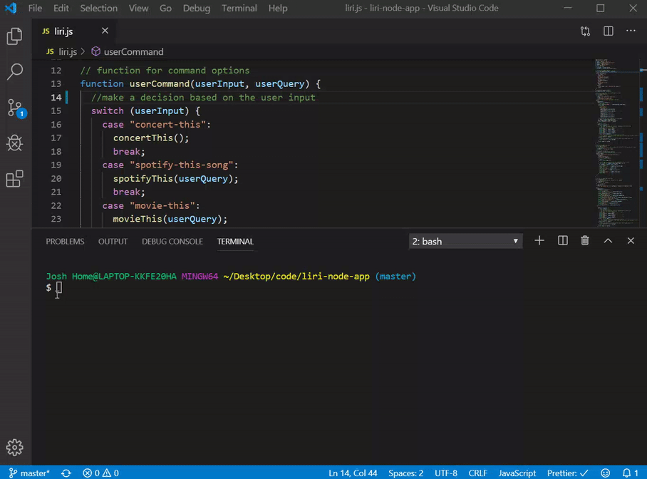
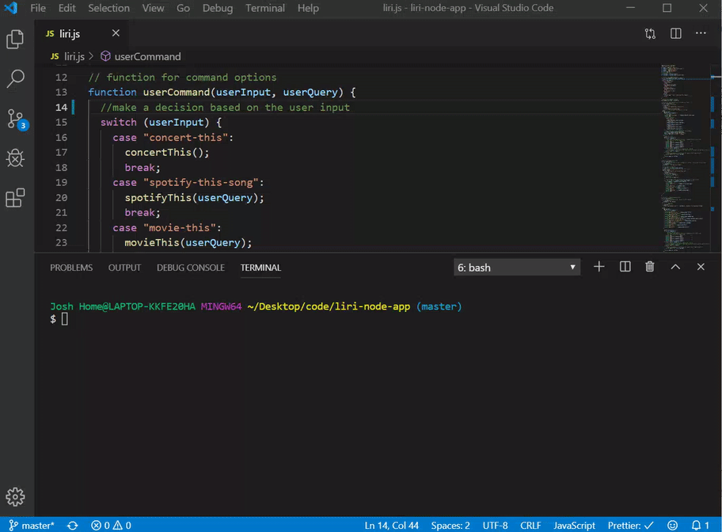

# liri-node-app

This is a LIRI bot application. LIRI is simimlar to iPhone's SIRI. However, while SIRI is a Speech Interpretation and Recognition Interface, LIRI is a Language Interpretation and Recognition Interface. It is a command line node app that takes in parameters and gives back the user data.

LIRI is an application for finding out information about band concert venues, information about song tracks, and information about movies. For anyone that is passionate about concerts, music, and movies LIRI is the perfect application for quickly finding information on each topic, and addresses the need of having to search on different websites to gather that information.

**Parameters of the Application and How to Use Them**

1.  **concert-this**
    concert-this searches Bands in Town Artist Events API and renders the following information about each event to the terminal:

    - Name of the venue
    - Venue location
    - Date of the Event, formated as "MM/DD/YYYY"

    How to initiate: node liri.js concert-this <artist/band name here>
    

2)  **spotify-this-song**
    'spotify-this-song' searches the Spotify API and renders the following information about the song in the users terminal/bash window:

    - Artist(s)
    - The song's name
    - A preview link of the song from Spotify
    - The album that the song is from

How to initiate: node liri.js spotify-this-song <song name here>

If no song is provided by the user, then the program will default to "The Sign" by Ace of Base.

3. **movie-this**
   'movie-this' searches the OMDB API for movie data and renders the following information about each event to the terminal:

   - Title of the movie.
   - Year the movie came out.
   - IMDB Rating of the movie.
   - Rotten Tomatoes Rating of the movie.
   - Country where the movie was produced.
   - Language of the movie.
   - Plot of the movie.
   - Actors in the movie.

   How to initiate: node liri.js movie-this <movie name here>
   

   If the user doesn't type a movie in, Liri will default to the movie 'Mr. Nobody.'
   

4. **do-what-it-says**
   'do-what-it-says' takes text from within the random.txt file and runs spotify-this-song based on that text.

   How to initiate: node liri.js do-what-it-says
   

**Technologies Used**

- Axios: Used to retrieve data from OMDB API and Bands In Town API
- Bands In Town API: API used to request data about band venues and locations
- Moment: Library used to convert date format of venue to "MM/DD/YYYY"
- Node-Spotify-API: API Used to request song information from spotify
- OMDB API: API Used to pull data of movie being searched
- DotEnv: package to set environment variables to the global process.env object in node

**Link to Application**
https://jlcoden.github.io/liri-node-app/

**Credits**
Developer and app creator: Josh Cosson
